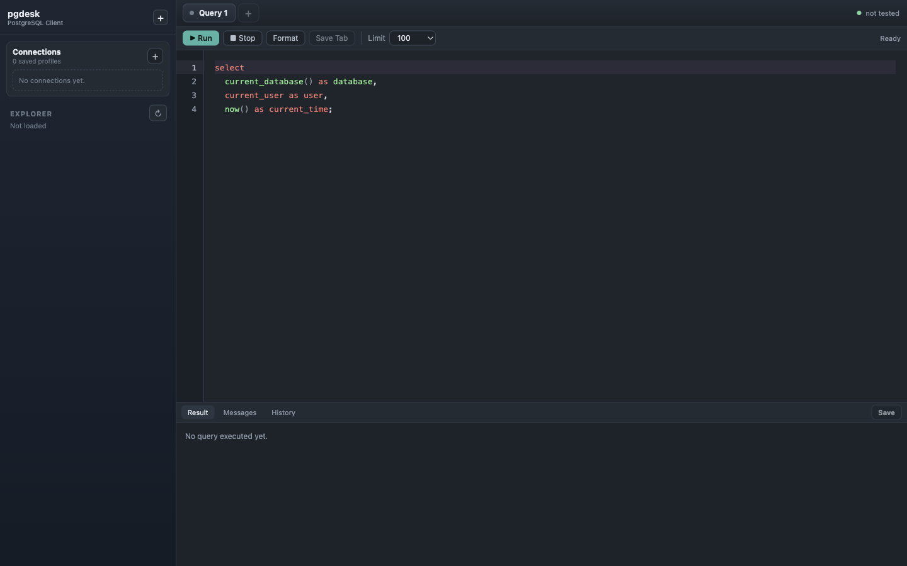
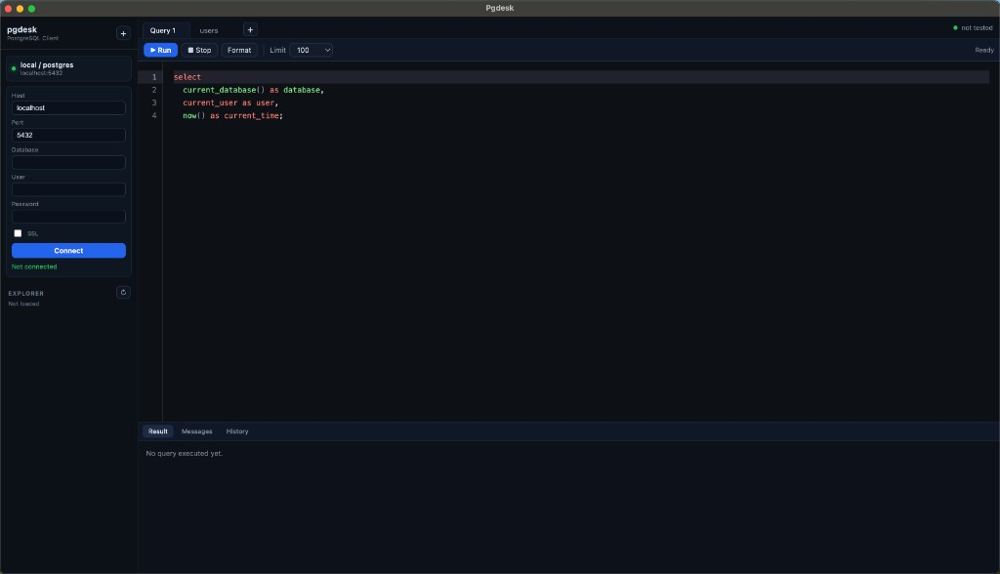

# PgDesk

PgDesk is a focused PostgreSQL desktop client for developers who want a clean
workspace for connecting to databases, browsing structure, writing SQL, editing
query results, and backing up data.

[Landing page](https://khanhpn.github.io/pg_desk/) ·
[Documentation](https://khanhpn.github.io/pg_desk/documentation.html) ·
[Releases](https://github.com/khanhpn/pg_desk/releases/latest)



## What PgDesk Does

- **Connection profiles** — save PostgreSQL connections with host, port,
  database, username, password, and optional SSL.
- **Splash-first startup** — show a branded loading screen while the main
  workspace stays hidden, then reveal the maximized app after it is ready.
- **Schema explorer** — browse schemas, tables, and views in a collapsible tree
  sidebar.
- **Multi-tab SQL editor** — create, close, save, and restore query tabs between
  sessions.
- **SQL formatter** — format ad hoc SQL from the editor toolbar.
- **Resizable workspace** — resize the left explorer and result panel to fit the
  task at hand.
- **Editable result grid** — edit returned rows directly when PgDesk can map
  cells back to a table primary key.
- **Boolean cell controls** — editable boolean values render as checkboxes.
- **Table inspector** — open table metadata and schema editing tools from the
  sidebar context menu.
- **Backup and restore** — export a database to a timestamped SQL file and
  restore from an existing backup.
- **Auto updates** — desktop update status and download actions are surfaced in
  the app.

## Screenshots

| Workspace                                                | Connection and editor                                           |
| -------------------------------------------------------- | --------------------------------------------------------------- |
|  |  |

The workspace screenshot is captured from the built Electron app with a clean
temporary profile so project documentation does not include local connection
data.

## Supported Platforms

| Platform                      | Status    |
| ----------------------------- | --------- |
| macOS Apple Silicon and Intel | Supported |
| Windows x64                   | Supported |
| Linux AppImage                | Supported |

## Backup Requirements

Backup and restore use PostgreSQL client tools:

- `pg_dump --format=plain` for readable `.sql` backups
- `psql` for restoring `.sql` backups
- `pg_restore` for restoring older `.dump` or `.backup` files

PgDesk searches common install locations for Homebrew, Postgres.app, libpq, and
Windows PostgreSQL folders. If your install is custom, set
`PGDESK_POSTGRES_BIN` to the folder containing `pg_dump`, `psql`, and
`pg_restore`.

If the database runs in Docker and local PostgreSQL tools are not installed,
PgDesk can use `docker exec` to run PostgreSQL tools inside the container. It
auto-detects a PostgreSQL/PostGIS container published on the active connection
port. If multiple containers are ambiguous, set `PGDESK_DOCKER_CONTAINER` to
the target container name.

## Development

Install dependencies:

```bash
pnpm install
```

Run the app in development:

```bash
pnpm dev
```

Build the app:

```bash
pnpm run build
```

The landing page version is synchronized from `package.json` before dev/build
and in the pre-commit hook.

## Testing

PgDesk uses Vitest for unit/component coverage and Playwright for Electron E2E
coverage.

```bash
pnpm test
pnpm run lint
pnpm run test:e2e
```

Current coverage includes:

- custom hooks for query tabs, relation selection, and database maintenance
- toolbar, topbar, and result grid component behavior
- Electron smoke test for launching the built app and verifying the main
  workspace

Pull requests into `main` run lint, Vitest, build, and Playwright E2E through
GitHub Actions.

## Releases

Release workflows build macOS and Windows artifacts from version tags. Download
the newest build from the
[latest release](https://github.com/khanhpn/pg_desk/releases/latest).

## Contributing

See [CONTRIBUTING.md](CONTRIBUTING.md) for repository setup, scripts, and
project structure.
